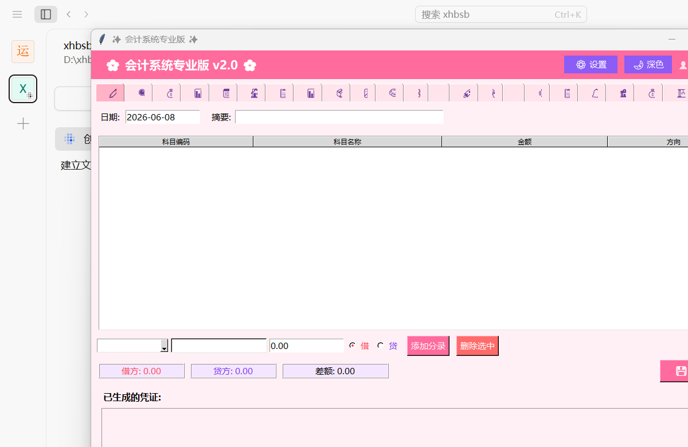
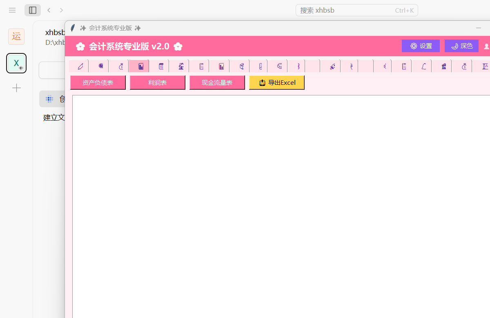
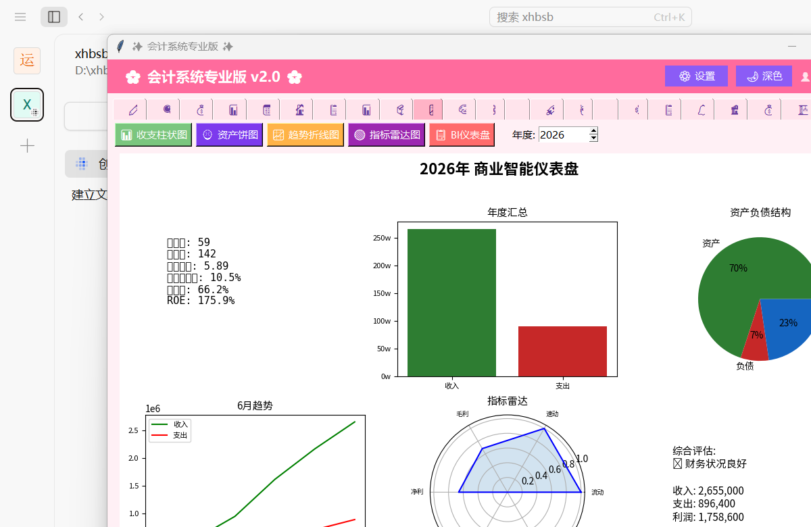
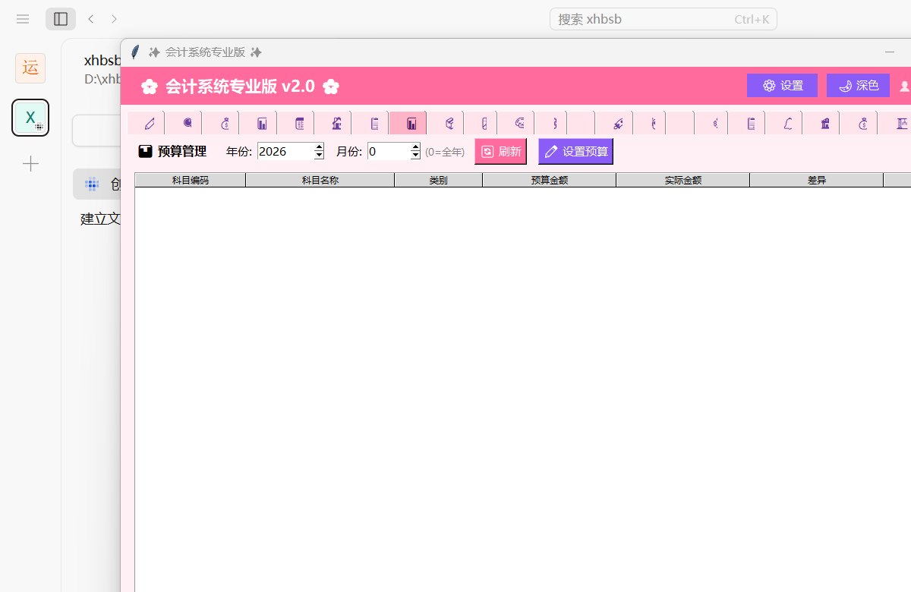

# ✨ 会计系统专业版 (Professional Accounting System)

<div align="center">

**全功能中文会计桌面应用 · 适合中小企业财务管理**

[](https://www.python.org/)
[](https://docs.python.org/3/library/tkinter.html)
[](https://www.sqlite.org/)
[](https://matplotlib.org/)
[](https://en.wikipedia.org/wiki/SHA-2)
[](https://openai.com/)
[](https://en.wikipedia.org/wiki/Environmental,_social_and_governance)
[](LICENSE)

</div>

> 一款功能全面的中文会计桌面系统，提供从凭证录入到财务报表、固定资产管理、税务计算、多币种核算、AI 智能分析、区块链账本、ESG 报告等 29+ 核心模块，覆盖中小企业财务管理的全流程需求。

> **📌 简历摘要：** Python / tkinter / SQLite 全栈自研，29+ 模块覆盖会计全流程。代码重构为 19 个模块化包，类型注解完备，96 个 pytest 测试全覆盖。支持 PyInstaller 打包为 43MB 单文件 EXE 分发。

---

## 📋 目录

- [功能特点](#-功能特点)
- [技术栈](#-技术栈)
- [项目结构](#-项目结构)
- [快速开始](#-快速开始)
- [打包为 EXE](#-打包为-exe)
- [运行截图](#-运行截图)
- [测试](#-测试)
- [许可协议](#-许可协议)

---

## 🚀 功能特点

### 📒 凭证管理
- 标准借贷记账法，支持多分录凭证
- 自动凭证编号与模板快速录入
- 凭证审核、查询、修改、删除、批量导出 (Excel/CSV)
- CSV 导入凭证

### 📊 财务报表
- **资产负债表** — 自动生成，资产 = 负债 + 所有者权益
- **利润表** — 多步式损益计算，营业利润 → 利润总额 → 净利润
- **现金流量表** — 间接法与直接法双模式
- **科目余额表 / 试算平衡表**
- **财务比率分析** — 流动比率、速动比率、资产负债率、毛利率、净利润率等
- **智能趋势预测** — 基于历史数据的下月预测

### 🏠 固定资产管理
- 固定资产卡片登记 (原值、残值、使用年限)
- 自动计提折旧 (年限平均法)
- 折旧明细查询与批量折旧运行
- 反折旧处理

### 🧾 税务计算
- **增值税 (VAT)** 计算与申报模拟
- **个人所得税 (PIT)** 预扣预缴，支持 7 级超额累进税率
- 税务速算表与减免参考
- 学生兼职税务指导

### 💱 多币种支持
- 实时汇率获取 (exchangerate-api.com)
- 手动汇率录入
- 外币业务凭证记录
- 多币种核算

### 📈 数据可视化
- 收支对比柱状图
- 资产负债表饼图
- 月度趋势折线图
- 财务比率雷达图
- 综合看板 (Dashboard)

### 🧠 智能分析
- **AI 云集成** — 支持 OpenAI / 兼容 API，自然语言财务问答
- **异常检测** — 自动识别异常分录与离群交易
- **智能建议** — 基于财务比率的经营建议
- **趋势分析** — 收入/费用月度趋势

### ⛓️ 区块链账本
- 基于 SHA-256 的区块链接结构
- 每笔凭证作为交易记录上链
- 区块链完整性验证 (防篡改)
- 区块链导出/导入 JSON
- 链状态统计 (区块数、交易数、时间线)

### 🌿 ESG 报告
- **环境 (E)** — 碳排放、能耗、用水、废弃物、可再生能源等指标
- **社会 (S)** — 员工总数、女性比例、培训时长、安全、客户满意度
- **治理 (G)** — 董事会、独立董事、合规、审计、数据安全
- 雷达图与趋势图分析
- 综合评分与报告导出

### 🤖 AI 助手
- AI 配置管理 (端点、密钥、模型、参数)
- 自动构建财务上下文
- 自然语言数据库查询 (Text-to-SQL)
- 财务顾问问答

### 📋 应收应付 (AR/AP)
- 应收账款 / 应付账款账龄分析
- 账龄区间划分 (30/60/90/180/365 天)
- 坏账准备自动计提 (按账龄比例)
- AR/AP 汇总与明细

### 📦 库存管理
- 产品档案管理 (编码、名称、规格、单价)
- **FIFO (先进先出)** 成本核算
- 入库 / 出库 / 盘点操作
- 库存流水与库存汇总查询
- 库存数量与金额实时更新

### 📊 预算管理
- 科目预算编制 (年初/月度预算)
- 预算执行进度监控
- 实际 vs 预算对比

### 💰 薪资管理
- 员工信息管理 (部门、岗位、基本工资)
- 自动工资计算 (社保、公积金、个税)
- 工资确认与凭证生成
- 工资发放记录查询

### 🏦 银企对账
- 导入银行流水
- 自动勾对 (自动对账)
- 对账状态管理
- 余额调节表

### 🏗️ 项目会计
- 项目立项与基本信息管理
- 项目收支明细 (关联凭证)
- 项目损益计算
- 项目利润分析

### 🔔 财务预警
- 自定义预警规则 (流动比率、资产负债率、净利润率等)
- 实时指标计算与预警触发
- 预警历史与处理
- 预警级别 (warning/critical)

### 📎 附件管理
- 凭证附件上传与管理
- 文件类型识别
- 附件目录自动初始化
- 附件删除与查看

### 🔐 多用户权限
- 用户登录/登出 (默认 admin/admin123)
- 角色权限管理 (管理员 / 会计 / 出纳)
- 操作审计日志
- 界面主题独立记忆

### 🌙 深色模式
- 浅色 / 深色主题一键切换
- 粉紫配色方案
- 主题持久化存储

### 🗓️ 期末结账
- 期末自动结转损益
- 期间状态管理 (未结账 / 已结账)
- 结账日志查询
- 反结账处理

### 📤 数据备份与恢复
- 数据库一键备份
- 备份文件管理
- 数据库恢复还原

### 🎓 考证助手
- CPA / 初中级会计 / 税务师考试信息
- 学习计划生成器
- 个人学习进度追踪

### 📈 微型账本
- 个人收支流水记录
- 收支分类汇总
- 学生税务参考

---

## 🛠️ 技术栈

| 类别 | 技术 | 用途 |
|------|------|------|
| **语言** | Python 3.10+ | 核心开发语言 |
| **GUI** | tkinter / ttk | 桌面图形界面，24 个功能 Tab |
| **数据库** | SQLite 3 | 本地数据存储 (单文件) |
| **图表** | matplotlib | 数据可视化 (柱状图、饼图、趋势图、雷达图) |
| **Excel** | openpyxl | 报表导出、样式美化 |
| **网络** | requests | 汇率获取、AI API 调用 |
| **加密** | hashlib (SHA-256) | 区块链哈希链 |
| **打包** | PyInstaller | 单文件 EXE 分发 |
| **图片** | Pillow | 图标与图片处理 |

---

## 📁 项目结构

```
accounting_system/                    # 项目根目录
│
├── accsys/                           # 后端核心包 (Python package)
│   ├── __init__.py                   #   统一导出入口
│   ├── constants.py                  #   全局常量、科目表、税率、ESG指标
│   ├── database.py                   #   数据库初始化与连接管理
│   ├── accounts.py                   #   科目表管理、试算平衡
│   ├── vouchers.py                   #   凭证 CRUD、导入导出
│   ├── reports.py                    #   财务报表 (资产负债表、利润表、现金流量表)
│   ├── assets.py                     #   固定资产管理与折旧计算
│   ├── tax.py                        #   增值税与个人所得税计算
│   ├── currency.py                   #   多币种汇率管理
│   ├── period.py                     #   期末结账与期间管理
│   ├── blockchain.py                 #   区块链账本 (SHA-256)
│   ├── esg.py                        #   ESG 报告与评分
│   ├── startup.py                    #   启动工具与微型账本
│   ├── ai.py                         #   AI 云集成配置与调用
│   ├── auth.py                       #   认证、权限、主题管理
│   ├── aging.py                      #   应收应付账龄分析
│   ├── budget.py                     #   预算编制与执行监控
│   ├── inventory.py                  #   库存管理 (FIFO)
│   ├── viz.py                        #   数据可视化图表生成
│   ├── audit.py                      #   审计轨迹日志
│   ├── alerts.py                     #   财务预警规则与检查
│   ├── backup.py                     #   数据库备份与恢复
│   ├── reconciliation.py             #   银企对账自动匹配
│   ├── payroll.py                    #   薪资计算、个税、凭证生成
│   ├── projects.py                   #   项目会计与损益分析
│   ├── cashflow.py                   #   现金流量表（直接法）
│   ├── attachments.py                #   文件附件上传与管理
│   └── cli.py                        #   命令行 TUI 交互界面
│
├── gui/                              # 前端 GUI 包
│   ├── app.py                        #   主应用骨架（~300行）
│   ├── constants.py                  #   UI 样式常量
│   └── tabs/                         #   24 个标签页模块（Mixin 模式）
│       ├── voucher.py                #   凭证录入
│       ├── query.py                  #   凭证查询
│       ├── accounts.py               #   科目余额
│       ├── reports.py                #   财务报表
│       ├── assets.py                 #   固定资产
│       ├── tax.py                    #   税务计算
│       ├── currency.py               #   多币种
│       ├── period.py                 #   期末处理
│       ├── aging.py                  #   应收应付
│       ├── budget.py                 #   预算管理
│       ├── inventory.py              #   库存管理
│       ├── viz.py                    #   数据可视化
│       ├── intel.py                  #   智能分析
│       ├── blockchain.py             #   区块链账本
│       ├── esg.py                    #   ESG 报告
│       ├── startup.py                #   创业工具
│       ├── ai.py                     #   AI 助手
│       ├── audit.py                  #   审计日志
│       ├── alerts.py                 #   财务预警
│       ├── recon.py                  #   银企对账
│       ├── payroll.py                #   薪资管理
│       ├── projects.py               #   项目会计
│       ├── cashflow.py               #   现金流量
│       └── attachments.py            #   附件管理
│
├── tests/                            # 测试目录 (pytest)
│   └── test_core.py                  #   96 个单元测试
│
├── screenshots/                      # 运行截图
├── main.py                           # 程序入口
├── requirements.txt                  # 依赖清单
├── accounting.py                     # 原始单文件版 (保留)
└── accounting_gui.py                 # 原始 GUI 单文件版 (保留)
```

---

## ⚡ 快速开始

### 前置要求

- Python 3.10 或更高版本
- pip 包管理器

### 安装与运行

```bash
# 1. 克隆仓库
git clone https://github.com/yourusername/accounting_system.git
cd accounting_system

# 2. 安装依赖
pip install -r requirements.txt

# 3. 运行程序
python main.py
```

程序启动后会自动创建 SQLite 数据库 (`accounting.db`) 和科目表，并弹出登录窗口。

> 默认管理员账号：`admin` / `admin123`

### 依赖清单

```
openpyxl      # Excel 导入导出
pyinstaller   # 打包为 EXE
pillow        # 图标与图片
matplotlib    # 数据可视化图表
requests      # AI API & 汇率请求
```

---

## 📦 打包为 EXE

使用 PyInstaller 打包为单文件可执行程序，无需 Python 环境即可运行：

```bash
# 标准打包 (带控制台窗口，方便调试)
pyinstaller --onefile --icon=accounting_icon.ico main.py --name=会计系统专业版

# 生产环境打包 (隐藏控制台窗口)
pyinstaller --onefile --windowed --icon=accounting_icon.ico main.py --name=会计系统专业版
```

打包完成后，可执行文件位于 `dist/会计系统专业版.exe`。

> 💡 如需生成安装包，运行 `build_installer.bat` (基于 NSIS)。

---

## 🌐 Web 版本 (Flask)

基于 `accsys` 包的独立性，增加 Flask Web 前端，展示后端逻辑完全解耦：

```bash
pip install flask
python seed_data.py      # 先填充种子数据
python webapp.py          # 启动 Web 服务
# 浏览器打开 http://localhost:5000
```

| 路由 | 功能 |
|------|------|
| `/` | 财务仪表盘 (KPI + 比率 + 预警) |
| `/vouchers` | 凭证列表 (按年月查询) |
| `/accounts` | 科目余额表 |
| `/reports` | 三张财务报表 |
| `/api/ratios` | 财务比率 JSON API |
| `/api/vouchers` | 凭证 JSON API |
| `/api/accounts` | 科目余额 JSON API |
| `/api/reports/*` | 报表 JSON API |

> 桌面 GUI (`/gui`) 和 Web 版 (`webapp.py`) 共用同一套 `accsys` 后端模块，证明 MVC 架构的解耦程度。

---

## 📸 运行截图

> 以下为功能界面预览，截图文件位于 `screenshots/` 目录。

```
screenshots/
├── 01_main.png          # 主界面 (凭证录入 + 种子数据)
├── 02_reports.png       # 财务报表
├── 03_viz.png           # 数据可视化看板
└── 04_aging.png         # 应收应付账龄分析
```

| 主界面 / 凭证录入 | 财务报表 |
|:------:|:--------:|
|  |  |
| **数据可视化看板** | **应收应付账龄** |
|  |  |

---

## 🧪 测试

```bash
# 安装测试依赖
pip install pytest

# 运行所有测试
pytest tests/ -v

# 运行指定测试模块
pytest tests/test_vouchers.py -v
```

---

## 📄 许可协议

本项目基于 **MIT License** 开源，您可以自由使用、修改和分发。

```
MIT License

Copyright (c) 2024-2026

Permission is hereby granted, free of charge, to any person obtaining a copy
of this software and associated documentation files (the "Software"), to deal
in the Software without restriction, including without limitation the rights
to use, copy, modify, merge, publish, distribute, sublicense, and/or sell
copies of the Software, and to permit persons to whom the Software is
furnished to do so, subject to the following conditions:
...
```

---

<div align="center">
  <sub>Built with ❤️ using Python & tkinter</sub>
  <br>
  <sub>会计系统专业版 · Professional Accounting System</sub>
</div>
